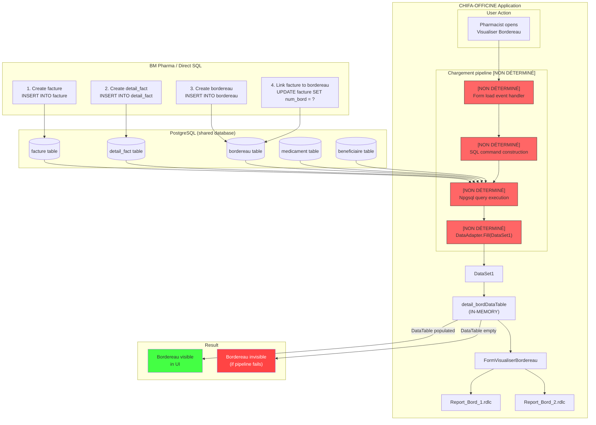

# BM-PHASE-009 — CHIFA Workflow

**Bordereau Display Pipeline**

> **Date:** 2026-07-28
> **Status:** PARTIAL — steps after PostgreSQL INSERT are not fully determined
> **Classification:** Confidential — BM Pharma Internal

---

## Complete Workflow Diagram

---

## Step-by-Step Description

### Steps CONFIRMED

| Step | Description | Confidence | Source |
|------|-------------|------------|--------|
| 1 | `facture` INSERT creates invoice record | CONFIRMED | BM-PHASE-008, TST003 |
| 2 | `detail_fact` INSERT creates line items | CONFIRMED | BM-PHASE-008, TST003 |
| 3 | `bordereau` INSERT creates batch record | CONFIRMED | BM-PHASE-008, TST003 |
| 4 | `facture.num_bord` UPDATE links invoice to bordereau | CONFIRMED | BM-PHASE-008, TST003 |
| 5 | PostgreSQL stores all records in typed tables | CONFIRMED | Phase 4 schema analysis |
| 6 | "Consultation Facture" reads `facture` table directly | CONFIRMED | TST003 experiment |
| 7 | `DataSet1` contains `detail_bordDataTable` | CONFIRMED | IL dump |
| 8 | `FormVisualiserBordereau` consumes `DataSet1.detail_bord` | CONFIRMED | UI analysis |
| 9 | `Report_Bord_1.rdlc` / `Report_Bord_2.rdlc` bind to `DataSet1.detail_bord` | CONFIRMED | UI analysis |

### Steps NOT DETERMINED

| Step | Description | Notes |
|------|-------------|-------|
| 5a | Form load event handler (method name, parameters) | Encrypted in binary |
| 5b | SQL command construction (text, parameters, formatting) | Compiled in DataSet |
| 5c | Npgsql connection management (when/how connection is opened) | Not observable |
| 5d | `DataAdapter.Fill()` or equivalent call | Encrypted in binary |
| 5e | Any pre-processing or validation before SQL execution | Unknown |
| 5f | Any post-processing after DataTable population | Unknown |
| 5g | Error handling (what happens if SQL fails or returns no rows) | Unknown |

---

## Key Observations

1. **"Consultation Facture" reads directly** from the `facture` table — data written by BM Pharma is immediately visible
2. **"Visualiser Bordereau" requires CHIFA's application pipeline** — the in-memory DataTable must be populated by CHIFA's compiled code
3. **The pipeline steps between PostgreSQL and FormVisualiserBordereau are a black box** due to ConfuserEx protection
4. **The same black box applies to RDLC reports** — they also depend on `DataSet1.detail_bord`

---

## Implications

| Implication | Severity | Description |
|-------------|----------|-------------|
| BM Pharma-created bordereaux are invisible in CHIFA UI | HIGH | Pharmacist cannot see BM Pharma data in Visualiser Bordereau |
| RDLC reports will not show BM Pharma bordereaux | MEDIUM | Reports depend on same DataTable |
| Cannot validate BM Pharma data through CHIFA workflow | MEDIUM | No way to confirm correct bordereau integration without CHIFA cooperation |
| Risk of duplicate or conflicting data | LOW | Both apps can create invoices in PostgreSQL without seeing each other's bordereaux |
