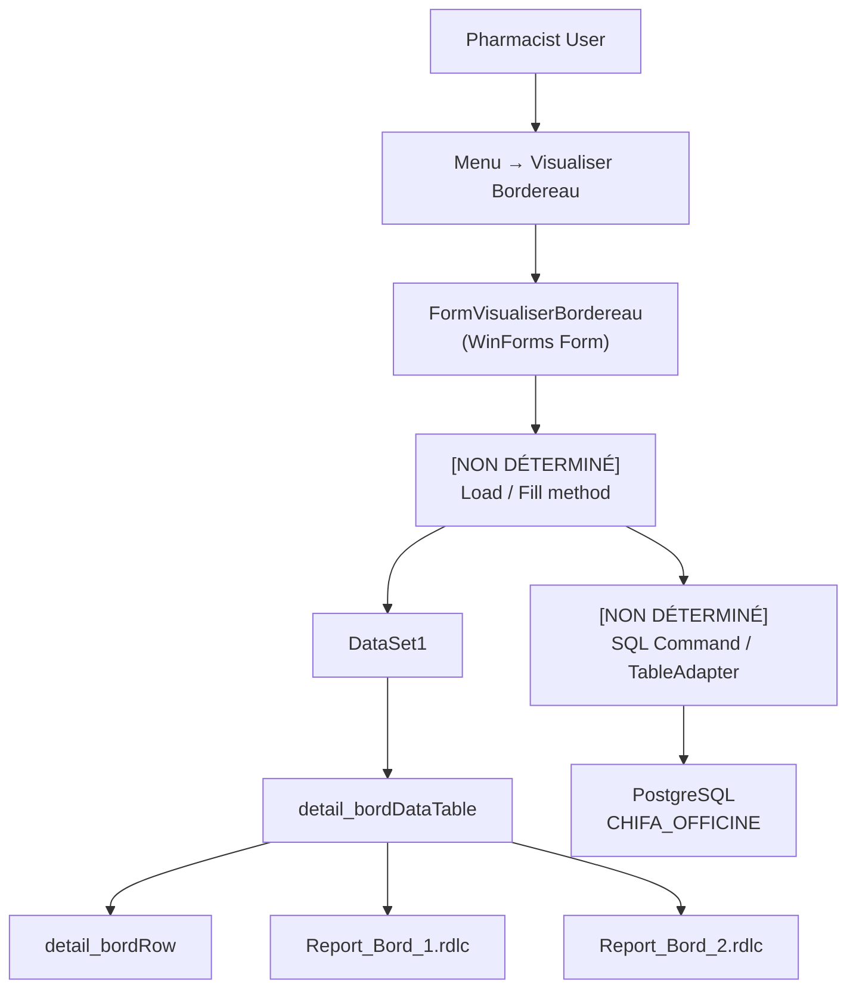

# BM-PHASE-009 — Visualiser Bordereau Call Graph

**Reverse Engineering — Data Flow & Component Interaction**

> **Date:** 2026-07-28
> **Status:** COMPLETE (partial — some methods not determined)
> **Classification:** Confidential — BM Pharma Internal

---

## Call Graph

---

## Component Inventory

| Component | Type | Identified By | Confidence |
|-----------|------|---------------|------------|
| `FormVisualiserBordereau` | WinForms Form | UI analysis (phase6) | CONFIRMED |
| `DataSet1` | Typed DataSet | IL dump (`full_dump.il`) | CONFIRMED |
| `detail_bordDataTable` | Typed DataTable (nested in DataSet1) | IL dump | CONFIRMED |
| `detail_bordRow` | Typed DataRow (nested in DataSet1) | IL dump | CONFIRMED |
| `detail_bordRowChangeEvent` | Row change event | IL dump | CONFIRMED |
| `detail_bordRowChangeEventHandler` | Event handler delegate | IL dump | CONFIRMED |
| `Report_Bord_1.rdlc` | RDLC report (bordereau page 1) | Embedded resource | CONFIRMED |
| `Report_Bord_2.rdlc` | RDLC report (bordereau page 2) | Embedded resource | CONFIRMED |
| Load/fill method | Private method | NOT DETERMINED | UNKNOWN |
| SQL command / TableAdapter | Data access component | NOT DETERMINED | UNKNOWN |
| BindingSource / DataGridView | UI binding | Inferred from WinForms pattern | PROBABLE |

---

## Data Flow Description

1. Pharmacist navigates Menu → Visualiser Bordereau
2. `FormVisualiserBordereau` is instantiated
3. A loading method (name unknown) executes:
   - Opens a connection to PostgreSQL via Npgsql
   - Executes a compiled SQL query against `bordereau`, `facture`, `detail_fact`, `medicament`, `beneficiaire`
   - Fills the `detail_bord` DataTable within `DataSet1`
4. The DataTable is bound to the form's DataGridView (or equivalent WinForms control)
5. When printing, `Report_Bord_1.rdlc` and `Report_Bord_2.rdlc` read from the same `DataSet1.detail_bord` DataTable
6. The exact SQL command text, TableAdapter configuration, and parameterization are compiled into the ConfuserEx-protected binary and are not extractable via static analysis

---

## Unknown Methods

| Method | Reason Unknown |
|--------|----------------|
| Form load / DataSet fill method | Method body is in encrypted ConfuserEx resource — not in IL dump |
| SQL command construction | Compiled into DataSet XML schema or code-behind — not extractable |
| TableAdapter / DataAdapter | If using typed DataSet, adapter is auto-generated and encrypted |
| WHERE clause parameters | Cannot be determined without decompilation or SQL logging |
| Error handling / edge cases | Encrypted in binary |

---

## Key Insight

The call graph is structurally identical to standard .NET WinForms DataSet pattern:
- Form → typed DataSet → typed DataTable → DataAdapter → SQL → PostgreSQL

The only difference is that the SQL and adapter are compiled into the encrypted assembly, making them opaque.
