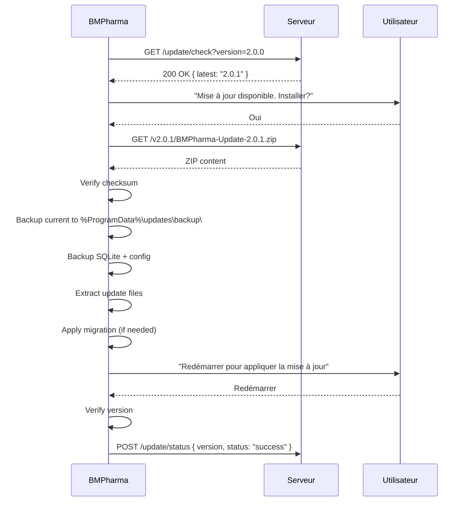
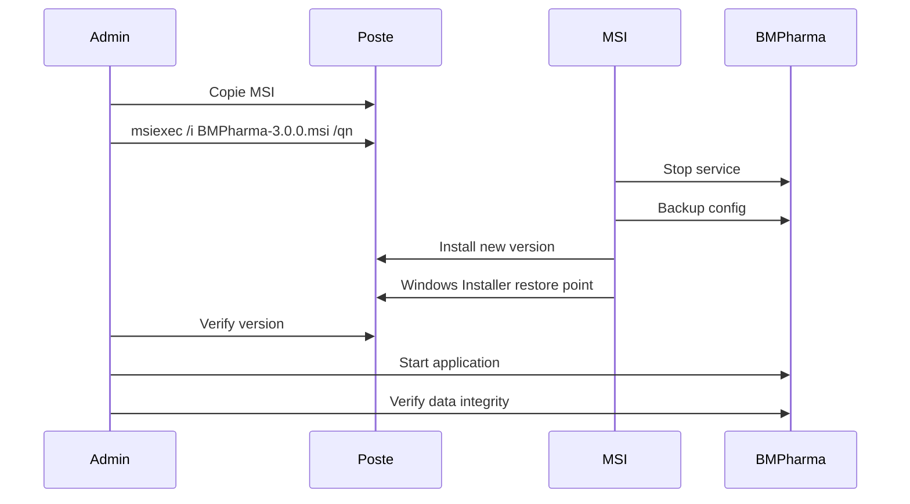

# 015-G — Update Strategy

**Phase:** 015 — Pilot Readiness Package  
**Date:** 2026-07-29  
**Objective:** Définir la stratégie de mise à jour de BM Pharma.

---

## Versioning Scheme

```
2.0.0
│ │ │
│ │ └── Patch (bug fix, sécurité, hotfix)
│ └──── Minor (nouvelle fonctionnalité mineure, non-breaking)
└────── Major (breaking changes, architecture)
```

| Type | Exemple | Contenu | Upgrade |
|------|---------|---------|---------|
| **Major** | 2.0.0 → 3.0.0 | Breaking changes, architecture | MSI complet |
| **Minor** | 2.0.0 → 2.1.0 | Nouvelle fonctionnalité, non-breaking | Auto-update |
| **Patch** | 2.0.0 → 2.0.1 | Bug fix, sécurité | Auto-update |
| **Hotfix** | 2.0.0 → 2.0.0-hf1 | Correctif urgent | Auto-update forcé |

---

## Update Types

### 1. Minor Update

| Champ | Valeur |
|-------|--------|
| **Déclencheur** | Nouvelle version détectée au démarrage |
| **Mode** | Auto-update (téléchargement + installation silencieuse) |
| **Redémarrage** | Requis (automatique après confirmation) |
| **Rollback** | Possible (backup automatique avant update) |
| **Sauvegarde** | Automatique avant update (config + SQLite) |

### 2. Major Update

| Champ | Valeur |
|-------|--------|
| **Déclencheur** | MSI fourni au pharmacien |
| **Mode** | MSI manuel (ou GPO) |
| **Redémarrage** | Requis |
| **Rollback** | Possible via MSI restore point |
| **Sauvegarde** | Obligatoire avant mise à jour |

### 3. Hotfix

| Champ | Valeur |
|-------|--------|
| **Déclencheur** | Correctif de sécurité ou bug critique |
| **Mode** | Auto-update forcé (mandatory: true) |
| **Redémarrage** | Requis immédiat |
| **Rollback** | Possible |
| **Notification** | Popup "Mise à jour de sécurité obligatoire" |

---

## Update Server Protocol

### Check Version

```
GET /update/check?version=2.0.0&channel=stable

200 OK
{
  "latestVersion": "2.0.1",
  "releaseDate": "2026-08-15",
  "channel": "stable",
  "mandatory": false,
  "allowDowngrade": false,
  "minVersion": "2.0.0",
  "description": "Correction du timeout PostgreSQL",
  "downloadUrl": "https://updates.bmpharma.com/v2.0.1/BMPharma-Update-2.0.1.zip",
  "checksum": "sha256-xxxxxxxxxxxxxxxxxxxxxxxxxxxxxxxx",
  "checksumType": "sha256",
  "fileSize": 5242880
}
```

### Download Update

```
GET /v2.0.1/BMPharma-Update-2.0.1.zip

200 OK
Binary content (ZIP)
Etag: "abc123"
```

### Update Manifest (inside ZIP)

```json
{
  "version": "2.0.1",
  "minVersion": "2.0.0",
  "mandatory": false,
  "allowDowngrade": false,
  "requiresRestart": true,
  "description": "Correction du timeout PostgreSQL",
  "releaseNotes": "https://updates.bmpharma.com/v2.0.1/release-notes.md",
  "files": [
    {
      "path": "BMPharma.UI.exe",
      "hash": "sha256-xxxx",
      "size": 102400
    },
    {
      "path": "BMPharma.CHIFA.dll",
      "hash": "sha256-yyyy",
      "size": 51200
    }
  ],
  "removeFiles": [],
  "configChanges": {},
  "dbMigrations": []
}
```

---

## Update Process (Minor/Patch)



---

## Update Process (Major)



---

## Rollback

### Auto-rollback (Minor/Patch)

```powershell
# rollback.ps1 — Automatiquement exécuté si la nouvelle version échoue au démarrage
$backupDir = "$env:ProgramData\BMPharma\updates\backup"
$installDir = "$env:ProgramFiles\BMPharma"

if (Test-Path $backupDir) {
    # Restore files
    Remove-Item "$installDir\*" -Recurse -Force -ErrorAction SilentlyContinue
    Copy-Item "$backupDir\*" -Destination $installDir -Recurse -Force
    
    # Restore config
    Copy-Item "$backupDir\appsettings.json" "$installDir\appsettings.json" -Force
    
    Write-Output "Rollback successful"
}
```

### Manual Rollback (Major)

```powershell
# 1. Restore via Windows Installer
msiexec /i BMPharma-2.0.0.msi /qn

# 2. Restore configuration
Copy-Item "D:\Backups\config\appsettings.json" "$env:ProgramFiles\BMPharma\appsettings.json" -Force

# 3. Restore SQLite
Copy-Item "D:\Backups\bmpharma-20260729.db" "$env:APPDATA\BMPharma\bmpharma.db" -Force
```

---

## Database Migration

### SQLite (BM Pharma local)

```csharp
public class MigrationManager
{
    private static readonly (int version, string sql)[] Migrations = {
        (1, "CREATE TABLE IF NOT EXISTS SchemaVersion (Version INTEGER, AppliedAt TEXT)"),
        (2, "ALTER TABLE Invoice ADD COLUMN ChifaStatus TEXT"),
    };

    public static void Apply(SqliteConnection db)
    {
        var currentVersion = GetCurrentVersion(db);
        foreach (var (version, sql) in Migrations)
        {
            if (version > currentVersion)
            {
                using var cmd = db.CreateCommand();
                cmd.CommandText = sql;
                cmd.ExecuteNonQuery();
                SetVersion(db, version);
            }
        }
    }
}
```

### PostgreSQL (CHIFA_OFFICINE)

- **Aucune migration automatique.** BM Pharma ne modifie pas le schéma CHIFA.
- Les mises à jour BM Pharma ne doivent pas nécessiter de changement sur le schéma PG.

---

## Update Channels

| Channel | Description | Utilisation | Cycle |
|---------|-------------|-------------|-------|
| `stable` | Versions validées | Pharmacie pilote | Mensuel |
| `rc` | Release candidate | Test interne | Hebdomadaire |
| `beta` | Pré-version | Développement | Continu |

---

## Release Notes Format

```markdown
# BM Pharma v2.0.1

**Date:** 2026-08-15
**Type:** Patch
**Channel:** stable

## Corrections
- Correction du timeout PostgreSQL lors de la synchronisation
- Amélioration du message d'erreur "Circuit Breaker ouvert"
- Correction de l'affichage des métriques dans le dashboard

## Sécurité
- Aucune vulnérabilité

## Base de données
- Aucune migration requise

## Rollback
- Possible : conserver la version 2.0.0
```

---

## Summary

| Aspect | Minor/Patch | Major | Hotfix |
|--------|-------------|-------|--------|
| Distribution | Auto-update | MSI | Auto-update forcé |
| Backup avant | Automatique | Manuel obligatoire | Automatique |
| Redémarrage | Requis | Requis | Immédiat |
| Rollback | Automatique | MSI restore | Automatique |
| Migration DB | SQLite auto | SQLite auto | Aucune |
| Notification | Popup | Email + popup | Popup urgent |
| Délai acceptation | 7 jours | 30 jours | Immédiat |
